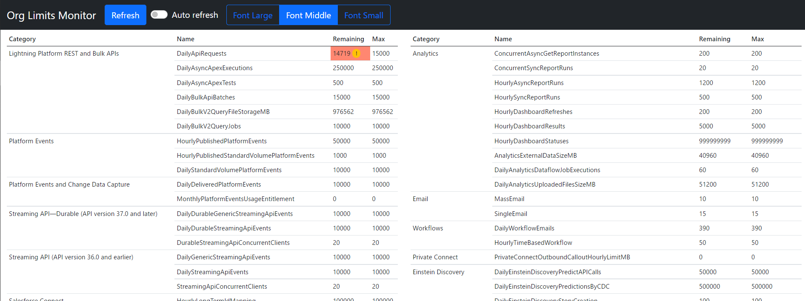

# org-limits-monitor
<p align="center">
  
  
  
  
</p>

Monitor salesforce organization's limits on a web browser
[](./images/sample.png)

## Installation
Install [Node.js](https://nodejs.org/) and place the following files in any directory.

* org-limits-monitor.js
* user_config.yaml
* files/*
* package.json
* package-lock.json

Open user_config.yaml and edit login URL, user name, and password to match your environment.
```
# Salesforce connection information
loginUrl: "https://login.salesforce.com"
apiVersion : "56.0"
userName: "(LOGIN USER NAME)"
password: "(LOGIN PASSWORD)"
# Default font size (0:small 1:middle: 2:large)
fontSize: 1
# Auto refresh interval(specified in seconds)
autoRefreshInterval: 10
# Web server listen port
listenPort: 3000
```
Install required libraries.
```
$ npm install
```

Start the server.
```
$ npm start
```

## Usage
Open your browser and visit http://localhost:3000.
The buttons on the screen are described below.
- Refresh: Get Org limits again and refresh the screen. If the value has been updated since last time, the updated value is marked.
- Auto refresh: If enabled, refresh at regular intervals. You can change the interval in the settings.
- Font Large - Font Small:  Change the font size.

If you want to use a non-default configuration file, specify the file with the -c option.
```
$ node org-limits-monitor.js -c YourSettingsFile.yaml
```

The following are the available options.
```
usage: org-limits-monitor.js [-options]
    -c <pathname> specifies a config file path (default is ./user_config.yaml)
    -s            silent mode
    -h            display this help
````

## Note
* Each time your press the Refresh button or each time refresh by auto refresh, the remaining value of DailyApiRequests will decrease by 1.

## License
org-limits-monitor is licensed under the MIT license.

